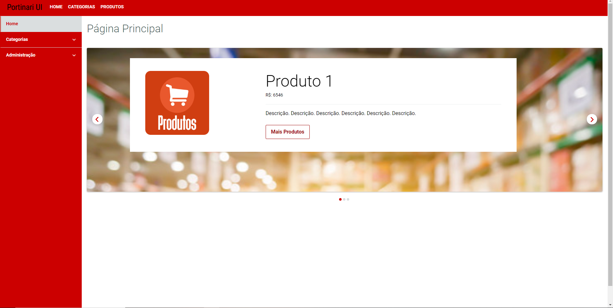
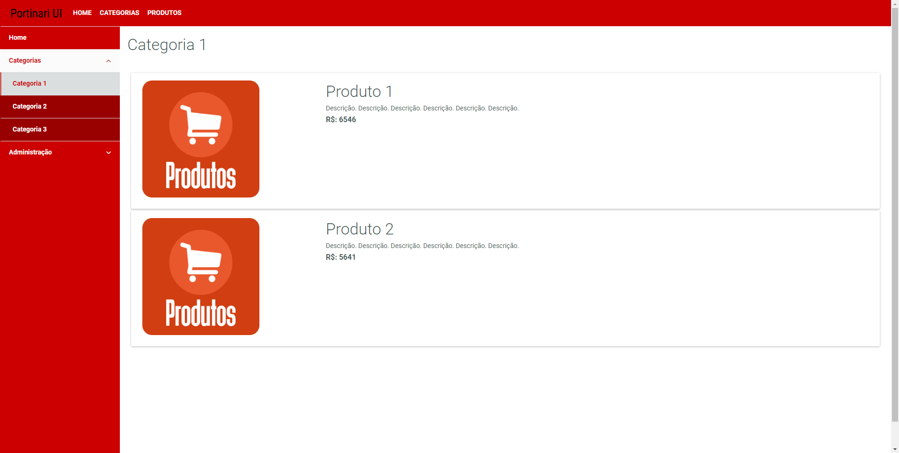
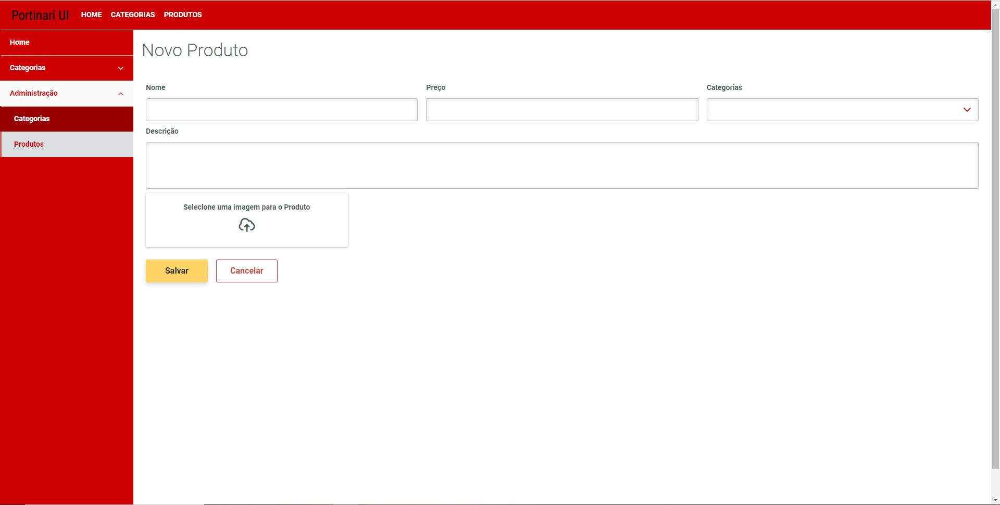

# cadastro-produtos-portinari
Cadastro de produtos e categorias feito com Portinari e back-end em node com o banco mongodb.

# Sobre
Aplicativo desenvolvido com o intuito de aprender mais sobre o framework Angular e a bilioteca open source Portinari desenvolvida pela TOTVS.

No aplicativo é possível criar categorias e produtos e fazer um relacionamento entre os mesmos, ou seja um produto pode ter 'n' categorias e uma categoria pode ter 'n' produtos.
Também é possível editar e remover produtos ou categorias, o aplicativo também tem suporte para o upload de imagens para os produtos.

# Screnshots

## Home

## Visualização de Produtos

## Adição de Produtos

